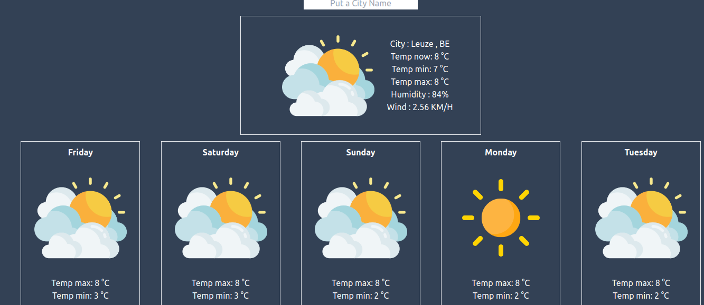

# weather-app

Becode exercise 18 : create a weather app with http flow and dom manipulation

## Briefing

[Instructions](https://github.com/becodeorg/CRL-KELLER-6/tree/main/1.TRAIL/2.The-Hill/1.DOM/13.Weather-app) for the exercise.

## Used languages

HTML, SASS, JavaScript, Vite

## Authors

Valentin Lefort

## Date

10/2023

## Page

[https://weather-app-gray-omega.vercel.app/](https://weather-app-tau-silk.vercel.app/)

## Printscreen

